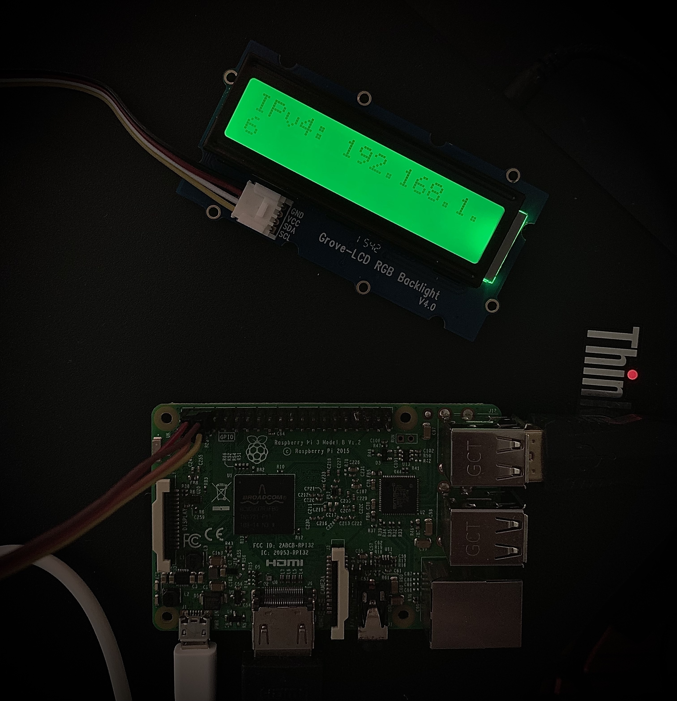
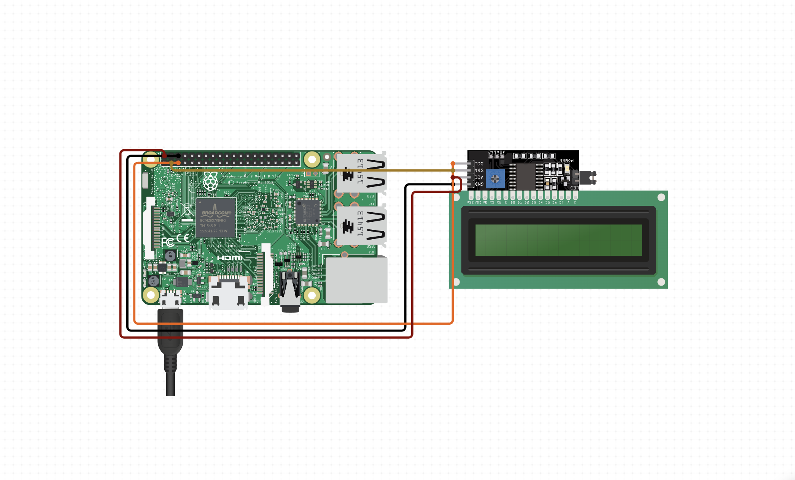

# IPV4 Viewer for Raspberry Pi

The IPv4 viewer is a small project that let's you determine your Raspberry Pi's ipv4 address in order to be able to SSH to it

# Screenshot



# Diagram



# Pre-requisites

- **Raspberry** Pi Model 3: This is the main component of the project, and it serves as the central processing unit for the system.

- **RGB LCD Display**: You will need an RGB LCD display that is compatible with the Raspberry Pi and uses an I2C interface. There are various models available, but you should choose one that matches the size and resolution requirements of your project.

- **I2C Interface**: To connect the RGB LCD display to the Raspberry Pi, you will need an I2C interface module. This module will allow the Raspberry Pi to communicate with the LCD display using the I2C protocol.

- **Power Supply**: The Raspberry Pi Model 3 requires a power supply that can deliver 5 volts and at least 2 amps. You can use a standard USB power supply, but make sure it meets the minimum requirements.

- **MicroSD Card**: The Raspberry Pi Model 3 requires a microSD card to store the operating system and project files. You will need a microSD card with at least 8GB of storage capacity.

- **HDMI Cable**: You will need an HDMI cable to connect the Raspberry Pi to a monitor or TV for setup and testing.

- **Keyboard and Mouse**: You will need a keyboard and mouse to interact with the Raspberry Pi during setup and testing.

# Setup

1. Create `systemctl` service file (e.g. `ipv4.service`) an place it in `/etc/systemd/system`

```ini

[Unit]
Description=Get IPV4 Address
After=multi-user.target

[Service]
Type=idle
ExecStart=/usr/bin/python3 [path-to-script]/ipv4.py

[Install]
WantedBy=multi-user.target
```

2. Once the `.service` file is created, reload the systemd daemon to ensure it picks up the new service file:

```bash
$ sudo systemctl daemon-reload`
```

3. Enable the service to start automatically at boot time using the enable command:

```
$ sudo systemctl enable ipv4.service
```

4. Start the service using the start command:

```bash
$ sudo systemctl status ipv4.service
```

5. Restart the raspberry pi and watch the lcd using:

```
$ sudo reboot
```
